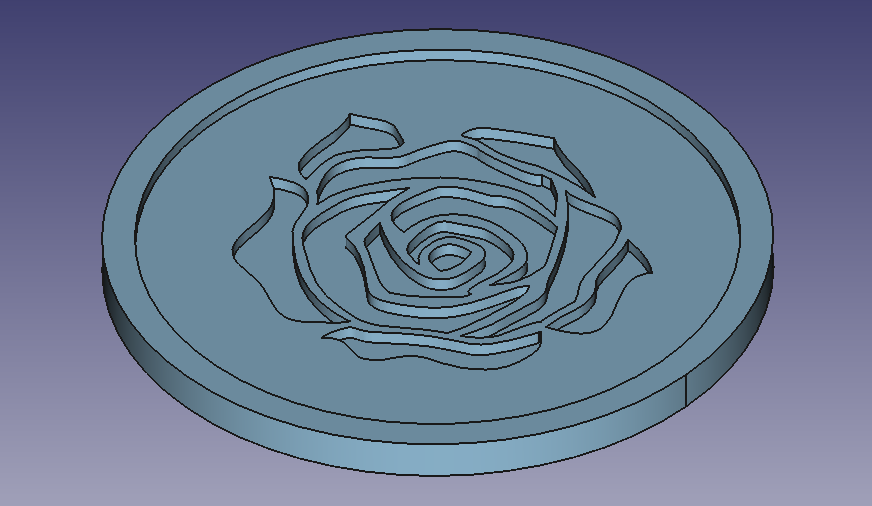

# rose-coaster

This is just a simple coaster design with a rose on it.

You can open the `rose-coaster.stl` right here on github and it should render it in 3D if you'd like to check out what this looks like before you download it.

I've also included the GRBL code that can be used on a GRBL CNC device to actually machine this design.

